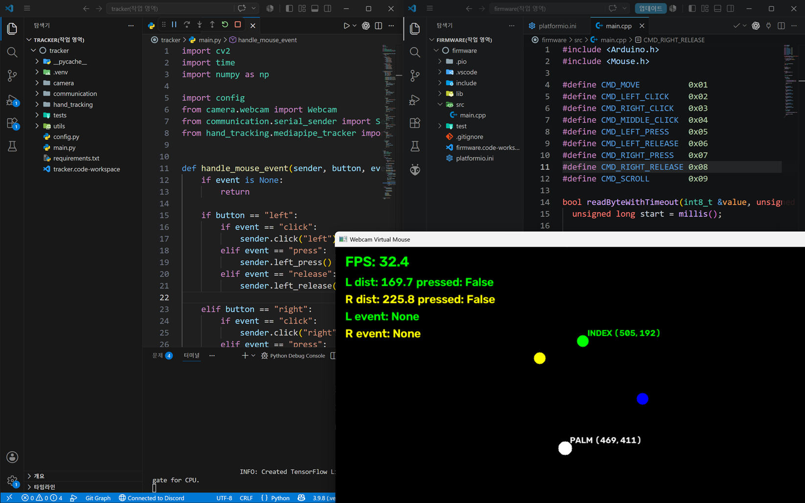

# 🖐️ Research-WebcamHandMouse

## Preview



---

## Introduction

> Python, OpenCV, MediaPipe를 이용하여 웹캠만으로 마우스를 제어하는 Hand Tracking 프로젝트  
> 현재는 Arduino HID를 통해 실제 USB 마우스를 제어하며, 추후 Python Virtual Mouse를 이용한 하드웨어 없는 방식도 지원할 예정이다.

---

## Requirements

> Python Version : 3.11 이상 권장

```cmd
pip install -r requirements.txt
```

---

## Note

> OpenCV를 이용한 웹캠 입력  
> MediaPipe Hands 기반 손 추적  
> Arduino Leonardo / Pro Micro HID 지원  
> **Python Virtual Mouse 지원 예정**  
> 단일 손 추적 최적화

---

# Webcam Hand Mouse

## 📌 개요

웹캠으로 손을 추적하여 마우스를 제어하는 프로젝트.

현재는 Arduino HID를 이용하여 운영체제에서 일반 USB 마우스로 인식되는 방식으로 동작하며, 추후에는 별도의 하드웨어 없이 Python Virtual Mouse를 이용해 가상 마우스를 제어하는 기능도 추가할 예정이다.

단순히 손가락 좌표를 따라가는 수준이 아니라 실제 마우스처럼 자연스럽게 사용할 수 있도록 다양한 움직임 보정 알고리즘을 적용하였다.

---

# 📌 프로젝트 목표

- 웹캠만으로 마우스 제어
- 실제 USB HID 마우스 지원
- **향후 Virtual Mouse 지원**
- 높은 반응속도
- 자연스러운 커서 움직임
- 클릭 오동작 최소화
- 확장 가능한 구조

---

# 📌 주요 기능

## 🖱️ 마우스 이동

- MediaPipe Hands 기반 손 추적
- 손 중심(Palm Center) 기반 포인터 이동
- X/Y 감도 개별 조절
- Deadzone 적용
- 최대 이동량 제한
- Alpha Smoothing 적용
- 저지연 동작

---

## 👆 클릭

초기 방식

- 검지 끝 좌표를 포인터 기준으로 사용

문제점

- 클릭 시 검지가 움직여 커서도 함께 흔들림

개선 방식

- 손 중심(Palm Center)을 포인터 기준으로 변경
- 엄지와 검지 사이 거리(Pinch)로 클릭 판정

적용 알고리즘

- Pinch Distance Threshold
- Pinch Hold 판정
- 짧은 Pinch = Click
- 긴 Pinch = Press 유지
- 자동 Release 감지

이를 통해 일반 클릭과 드래그를 자연스럽게 구분할 수 있도록 구현하였다.

---

## 🤏 드래그

- Pinch 유지 시 Left Button Press
- 손 이동 시 Drag
- Pinch 해제 시 Release

---

## ⚙️ 움직임 보정

현재 적용

- Deadzone
- Alpha Smoothing
- Max Movement Clamp
- Sensitivity 조절
- Palm Tracking

향후 적용 예정

- Velocity Filter
- Adaptive Smoothing
- Motion Prediction
- Kalman Filter

---

## 🔌 마우스 출력 방식

### 현재 구현

Python

↓

Serial (115200bps)

↓

Arduino Leonardo / Pro Micro

↓

USB HID Mouse

지원 명령

- Move
- Left Click
- Right Click
- Middle Click
- Left Press
- Left Release
- Right Press
- Right Release
- Scroll

---

### 향후 구현 예정

Python

↓

Virtual Mouse Driver

↓

운영체제

↓

가상 마우스 입력

별도의 Arduino 없이 Python만으로 마우스를 제어할 수 있도록 구현할 예정이다.

---

# 📂 프로젝트 구조

```text
project/

│

├── main.py

├── config.py

├── mediapipe_tracker.py

├── serial_mouse.py

├── firmware/
│   └── firmware.ino

└── requirements.txt
```

---

# 📌 기술 스택

### Python

- OpenCV
- MediaPipe
- PySerial
- NumPy

### Firmware

- Arduino
- USB HID Mouse Library

### Hardware

- Webcam
- Arduino Leonardo / Pro Micro

---

# 📌 Config

현재 주요 설정

```python
# MediaPipe

MAX_NUM_HANDS = 1
MODEL_COMPLEXITY = 1
MIN_DETECTION_CONFIDENCE = 0.7
MIN_TRACKING_CONFIDENCE = 0.7

# Mouse

SENSITIVITY_X = 2.3
SENSITIVITY_Y = 2.3
DEADZONE = 1
MAX_MOVE = 60

# Smoothing

ENABLE_SMOOTHING = True
SMOOTHING_ALPHA = 0.35
```

모든 움직임은 Config만 수정하여 쉽게 튜닝할 수 있도록 설계하였다.

---

# 📌 리팩토링

### 초기 구조

```text
main.py

 ├── Camera
 ├── Tracking
 ├── Gesture
 └── Mouse Control
```

### 현재 구조

```text
main.py

      │
      ▼

mediapipe_tracker.py

      │
      ▼

Gesture Detection

      │
      ▼

Mouse Event

      │
      ▼

serial_mouse.py
```

손 추적과 제스처 처리를 `mediapipe_tracker.py` 내부로 이동하여 `main.py`는 실행 및 제어만 담당하도록 구조를 개선하였다.

---

# 📌 개발 과정에서 해결한 문제

### 검지 기반 포인터

문제

- 클릭 시 검지가 움직여 커서도 함께 흔들림

해결

- 손 중심(Palm Center) 기반 포인터로 변경

---

### Raw Tracking

문제

- MediaPipe 좌표를 그대로 사용하여 떨림 발생

해결

- Alpha Smoothing
- Deadzone
- 이동량 제한 적용

---

### Pinch 오동작

문제

- 거리만 비교하면 클릭과 드래그를 구분하기 어려움

해결

- Distance Threshold
- Hold Time
- Press / Release 상태 관리

---

### 구조 개선

문제

- Gesture 처리 코드가 `main.py`에 집중

해결

- `mediapipe_tracker.py`로 리팩토링
- 유지보수성 향상

---

# 📌 향후 개발 예정

- ✅ Python Virtual Mouse 지원
- Scroll Gesture
- Right Click Gesture
- Double Click Gesture
- Multi Gesture
- Multi Monitor 지원
- 손 인식 안정성 향상
- Adaptive Smoothing
- Kalman Filter
- FPS 최적화
- GUI 설정 프로그램
- 사용자별 프로필 저장

---

# 📌 최종 목표

- 웹캠만으로 자연스럽게 사용할 수 있는 핸드 트래킹 마우스 구현
- Arduino HID와 Python Virtual Mouse를 모두 지원하는 듀얼 출력 구조 개발
- 실제 USB 마우스와 유사한 사용감 제공
- 누구나 확장하여 사용할 수 있는 오픈소스 Hand Tracking Mouse 플랫폼 구축